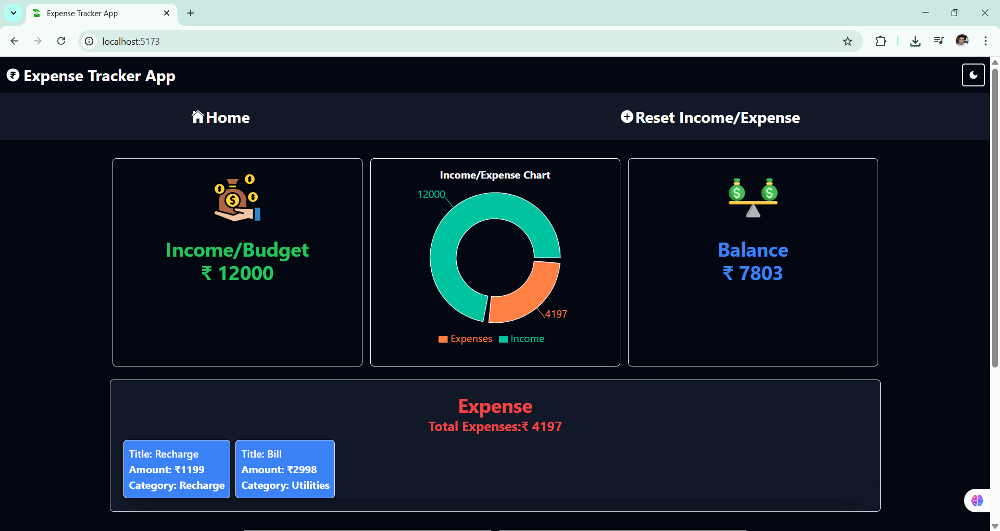
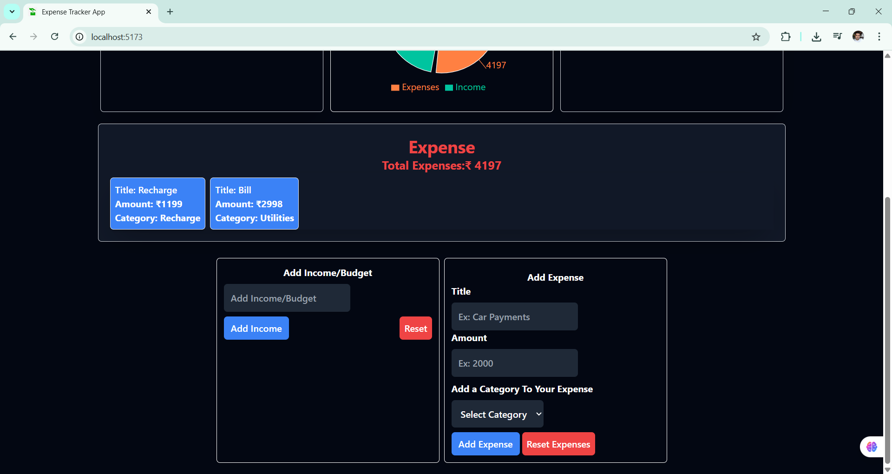
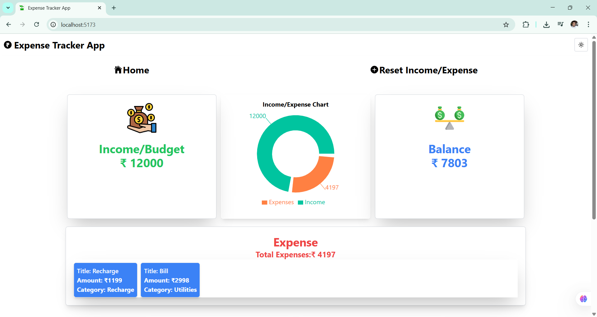
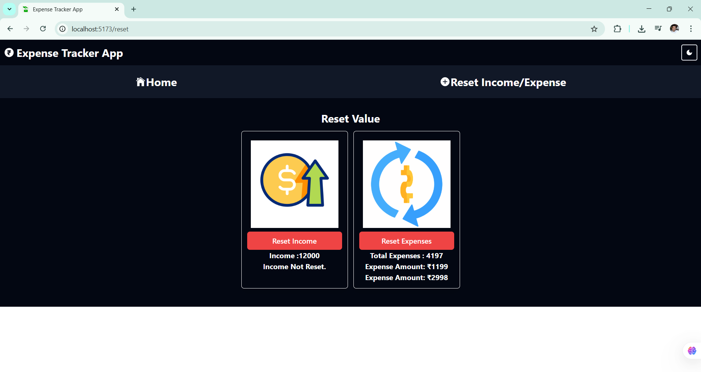
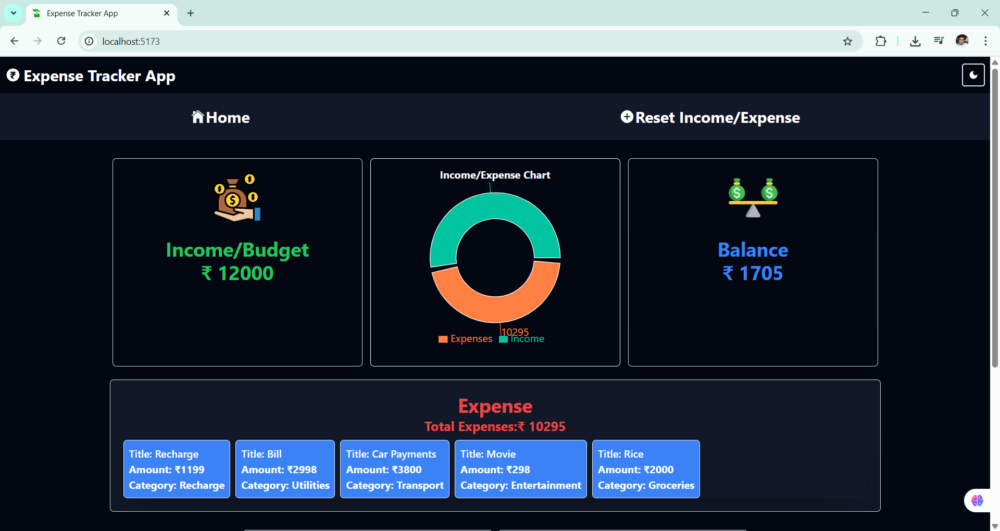

### EXPENSE TRACKER APP

[LIVE LINK](https://expensetrackerappkapil.netlify.app/)

### OVERVIEW :

- An Expense Tracker App created using React,Tailwind-CSS,Redux-Toolkit.

- User can add,reset Income/Budget.

- User can add,reset Expenses on basis of Expense-Title,Expense-Amount,Expense-Category.

- User can View total expense amount.

- User can View Balance Amount(Income/Budget-Expense-Amount).

- User Can Every Details in PieChart and Tooltip.

- Toggle between Dark/Light Mode using Redux Toolkit.

- Every Operations are stored using local storage. 

### Libraries and Technologies Used :

- React: A JavaScript library for building user interfaces.
- React Router DOM: For handling routing and navigation in the application.
- Redux Toolkit: To manage the global state and store.
- Tailwind CSS: For modular and responsive styling.
- Rechart : A composable charting library built on React components